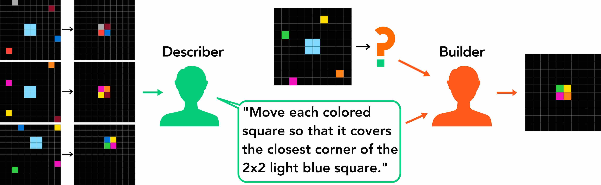

#  Communicating Natural Programs to Humans and Machines
This repository is the official implementation for the language-guided program synthesis experiments in **Communicating Natural Programs to Humans and Machines** (Section 5, Executing Natual Programs). The paper is currently under review. This repository and branch is a static branch designed to reproduce the results in the paper.



## Getting Started: Dependencies and Requirements
The experiments in the paper were conducted on an academic supercomputing cluster (Ubuntu machines, 24 parallel CPUs per experiment.) The following setup has been tested on both Ubuntu and Mac (OS Catalina). The codebase is implemented in both Python and OCaml.

##### Install Python 3.7.7 and the Python requirements.
1. We test our implementation on 3.7.7. On Linux, you can create a fresh install (including pip) with:
```
sudo apt-get update; sudo apt-get install software-properties-common; 
sudo add-apt-repository ppa:deadsnakes/ppa; sudo apt-get update; 
sudo apt-get install python3.7; sudo apt install python3.7-dev; 
sudo apt install python3-pip; python3.7 -m pip install pip;
pip install --upgrade setuptools;
```
2. Install the requirements.
```
pip install -r iclr_2022_requirements.txt
```
3. Download the T5 pre-trained language model. At an interactive prompt, run:
```
> import transformers; from transformers import T5EncoderModel; T5EncoderModel.from_pretrained('t5-small')
```

##### Build the OCaml binaries.
The repository contains prebuilt OCaml binaries that should run on most Linux-based machines. However, to build the OCaml binaries from scratch, you can run the following from the root of the repo.
1. Install OCaml.
```
sudo apt install ocaml ; 
sudo apt install opam ; 
opam init; opam update; 
opam switch 4.06.1+flambda ;
eval `opam config env`;
```
2. Install the OCaml requirements.
```
opam depext ppx_jane core re2 yojson vg cairo2 camlimages menhir ocaml-protoc zmq; 
opam install ppx_jane core re2 yojson vg cairo2 camlimages menhir ocaml-protoc zmq;
```
3. Run the following from the directory root to build the binaries.
```
make clean; make
```
##### LARC Dataset 
The program synthesis experiments use **LARC (Language-complete Abstraction and Reasoning Corpus)** (Sec. 3 of the paper), a dataset containing human descriptions of the ARC[https://github.com/fchollet/ARC] (Chollet 2019)  inductive reasoning tasks gathered via a 2-participant communication game. The full language dataset collection procedure is described in the main paper and released separately. This repository also contains the following pre-processed versions of this dataset, which can be used directly to reproduce the results of the reported experiments:

1. ARC tasks. Our experiments use the training dataset (n=400 tasks) from the original ARC repository. JSON files containing the input/output examples for each task and a task_id are in `arc_data/data/training/<task_id>.json`.
2. Human natural language task annotations. Sentence-parsed annotations for each task from the human experiment are in `data/arc/language/sentences/language.json`, in a dict mapping from task_id to an array of strings for each task.
3. Natural language DSL function annotations. Additional expert-written annotations for each _function_ in the DSL, used in the _pseudo-annotation_ training procedure (Sec. 5.1), are available in `data/arc/primitiveNamesToDescriptions.json`. This maps each function in the DSL to both a human readable name and a human readable short gloss (stored in a `[name, gloss]` tuple); we use the gloss for our experiments. During training and execution, these natural language annotations are used along with the formal DSL, implemented in OCaml, in `solvers/arc.ml`.

##### Training and Evaluation.
The script to train and evaluate any of the reported models on the paper (including calling the LARC dataloader) is located at ```bin/arc.py```.

A full list of commandline arguments (and descriptions of their functions) can be found by running 
```
python bin/arc.py -h
```

By default, as the algorithm is iterative, the training scripts will both run the algorithm for a specified number of iterations, and evaluate on a held-out test task every n iterations (where n is an adjustable argument.)

Running the commands below will produce fairly verbose log outputs that include evaluation metrics, and the location of the model checkpoint. In particular, running
```
grep 'checkpoint' [LOG_FILE]
``` 
will print out the path of the checkpoints at each iteration, and running

```
grep 'Hits' [LOG_FILE]
```
will print out the held-out task evaluation metrics.

It is also possible to resume and evaluate a model checkpoint from any iteration in training. By default, the scripts write timestamped checkpoints to a directory titled `experimentOutputs` (the exact directory appears with other informaiton in the output.)

The ```--resume [CHECKPOINT_PATH]``` commandline argument will resume training from a checkpoint, including to re-run evaluation tasks.

For additional information on the command line output (and default scripts to graph the outputs from the checkpoints), see docs/EC_README.md.

###### Command line arguments for experiments
To train and evaluate the best-performing model in the paper (Table 1, IO + NL, initialized from tasks solved after a 1hr initial enumeration from the base DSL), run:
```
python bin/arc.py --enumerationTimeout 720 --no-dsl --testingTimeout 0 --iterations 5 --taskBatchSize 200 --testEvery 1 --recognitionSteps 10000 --biasOptimal --contextual --no-cuda --CPUs 24 --featureExtractor LMPseudoTranslationFeatureExtractor --Helmholtz 0.5 --no-background-helmholtz --no-consolidation --taskReranker randomShuffle --seed 2  --preload_frontiers experimentOutputs/arc/2021-09-30T12:23:24.378667/arc_aic=1.0_arity=0_ET=10_t_zero=1_it=1_MF=10_noConsolidation=True_pc=10_RW=False_solver=ocaml_STM=True_L=1.0_batch=200_TRR=randomShuffle_K=2_topkNotMAP=False_UET=3600_DSL=True_rec=False.pickle'
```
